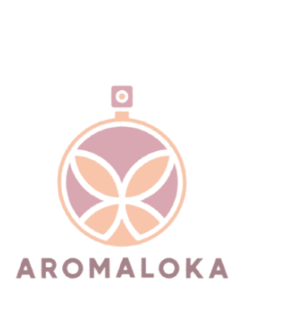

# Aromaloka
 

  

  <h1 align="center">Aromaloka</h1>

  

    Elevate Local Fragrance Journey with AI-Powered Perfume Insights!
    <!--   -->
    <!-- <a href="https://github.com/github_username/repo_name"><strong>Explore the Projects »</strong></a> -->
     
     
    

<!-- TABLE OF CONTENTS -->

  
<h2 style="display: inline-block">Table of Contents</h2>

  <ol>
    <li>
      <a href="#about-the-project">About The Project</a>
    </li>
    <li><a href="#team-members">Team Members</a></li>
    <li><a href="#our-projects-repository">Our Projects Repository</a></li>
    <ul>
      <li><a href="#prerequisites">Prerequisites</a></li>
    </ul>
    </li>
    <li><a href="#prerequisites">Features of this Project</a></li>
  </ol>

## About The Project

The fragrance market in Indonesia is forecasted to have growth at a compound annual growth rate of 3.6% and is driven by the rise in disposable income and a young population base. In 2020, the revenue of the fragrance market in Indonesia stood at USD 394 million. The Statista Consumer Market Outlook estimates that this revenue will reach nearly 500 million dollars by 2025.

From the point of view of consumers, perfume shopping can be overwhelming due to the huge number of options available in the local market as the perfumery market is growing in Indonesia while at the same time lacking sufficient media and places for consumers to get to know the products better, making it difficult for customers to choose or discover a fragrance that they will like. In addition, the digital platform (e-commerce) through which local perfumes are primarily sold can be quite confusing for consumers looking to purchase perfume. Aromaloka enables users to discover and learn about the Indonesian local perfumes they intend to buy with the help of AI to give them recommendations to make informed purchases.  

## Team Members

|         Member               | Student ID   |        Path        |
| :--------------------------: | :----------: | :----------------: | 
|   Muhammad Rifqi Riansyah M. |  C017DSX0774  |  Cloud Computing  |         
|      Alvito Rizqi Sobri      |  C017DSX0770  |  Cloud Computing  |             
|        Aiko Sulaiman         |  M181DSY0503   |  Machine Learning|         
|    Haje Noorjamani           |  M017DSX0456   | Machine Learning |           
|  Sophie Andira Cindani G.    |  M181DSY3469   | Machine Learning |            
|   Frances Xaviera Leony G. S.|  A151DSY2733   |Mobile Development|                           

## Our Projects Repository

- [Aromaloka Android Apps]()
- [Aromaloka Machine Learning Recommendation Model]()
- [Aromloka API](https://github.com/alvitorzq/aromaloka)

### Prerequisites

- Minimum of Android 5.0 Lolipop
- Internet Connection

## Features of This Projects

1. Funcionality
   - Register
   - Login
   - Profile Form
   - Perfume Recommendation
   - Perfume Searching
   - Brand Searching
   - Perfume shop hyperlink
   - Perfume Filtering
   - Perfume Favorite List
   - Adding perfume to favorite list
   - Removing pefume from favorite list
 

2. Non Funcionality
   - Application only runs on Android OS
   - The system can be accessed in any area in Indonesia
   - The system has a user-friendly interface

